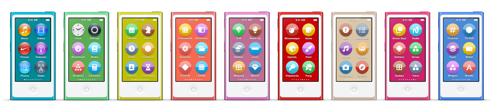
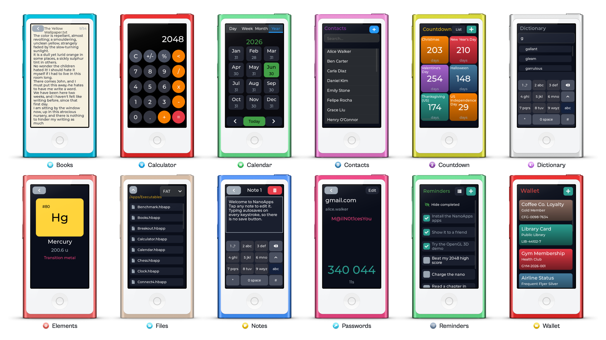
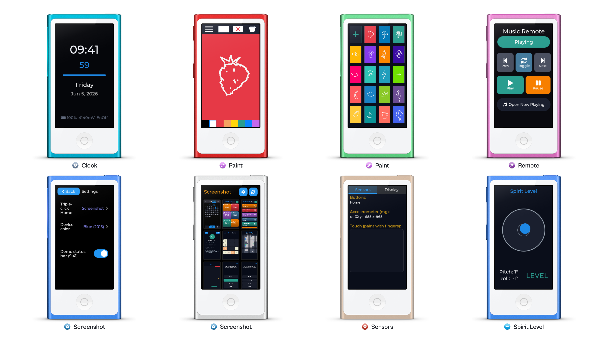
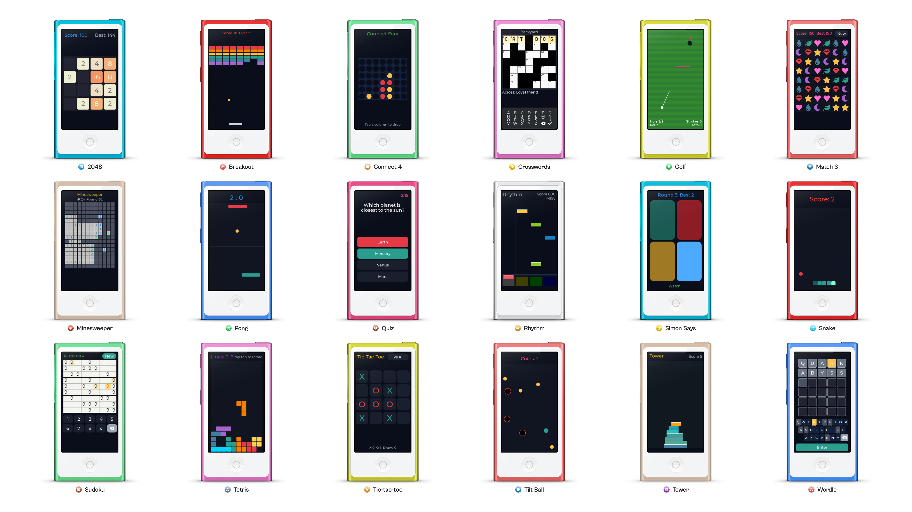
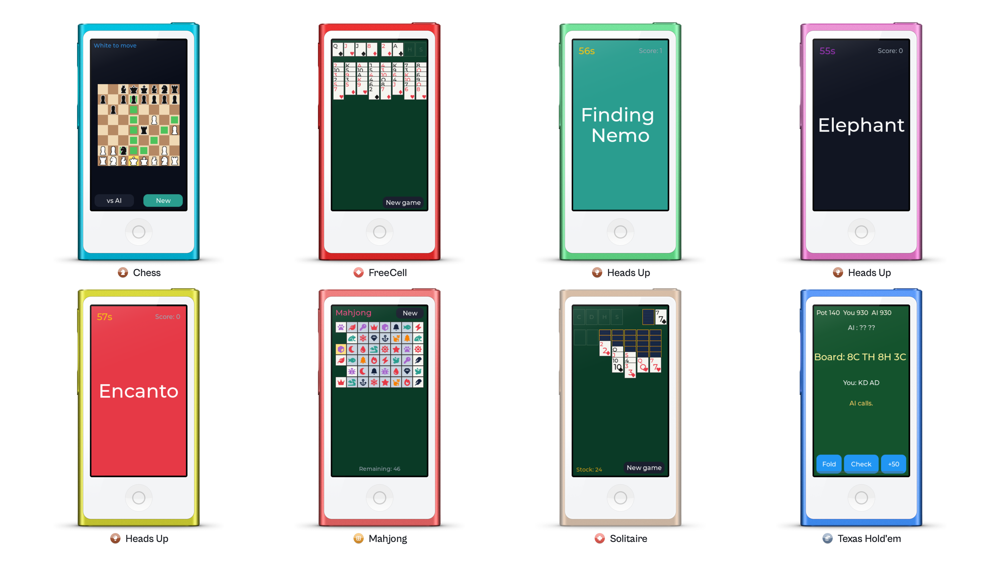
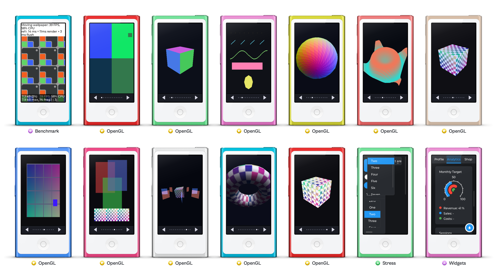

# NanoApps

**Run homebrew apps on iPod nano 7th generation.**
[](https://www.youtube.com/watch?v=18ioMXBhhTA)
▶️ **[Watch NanoApps in action on YouTube.](https://www.youtube.com/watch?v=18ioMXBhhTA)**

NanoApps Beta lets you [run a collection of](#included-apps), and [build your own](#contributing-to-nanoapps), homebrew apps on iPod nano 7th generation. Out of the box it includes essential utilities like Calculator, Countdown Days, Files, Paint, and Screenshots, productivity tools like Calendar, Notes, Reminders, and Books, and lightweight games like 2048, Tetris, Minesweeper, and Rhythm.

Homebrew apps appear as colorful icons on the native nano Home Screen, render with the full LVGL widget toolkit, and launch with the familiar zoom animation, so they feel at home next to Music and Photos. Games and visualization apps can also use OpenGL ES for 3D rendering. Contributions are very welcome: see [Contributing to NanoApps](#contributing-to-nanoapps), join the [iPod nano Hacking Discord](https://discord.gg/7PnGEXjW3X), and share what you build on [r/ipod](https://www.reddit.com/r/ipod/).

## Getting Started

You need:

- [iPod nano 7th generation](https://www.backmarket.com/en-us/search?q=iPod+nano+7)
- A [Linux computer](https://www.debian.org) (such as a [Raspberry Pi](https://www.raspberrypi.com)) to connect the iPod to

NanoApps depends on ipod_sun_untethered. On a Windows PC, visit the [ipod_sun_untethered releases page](https://github.com/nfzerox/ipod_sun_untethered/releases), download the IPSW for your iPod nano 7 model, and restore it with [iTunes](https://www.apple.com/itunes/). Mac-formatted iPods can work, but writing to an HFS formatted iPod from Linux/Raspberry Pi is experimental.

The SCSI command channel installed by ipod_sun_untethered can cause the iPod to repeatedly reboot when connected to iTunes, Apple Devices, or Finder. After restoring, disconnect the iPod from your Windows PC or Mac, and connect it to your Raspberry Pi or a Linux machine. 

To sync music, put your iPod in Disk Mode: Connect iPod to Windows PC or Mac. Press and hold both Home and power button. When the screen goes dark, but before the Apple logo shows up, immediately release Home and power, then press and hold volume up and volume down. iPod should enter Disk mode with "OK to disconnect" on screen, letting you sync music. After you're done, press and hold both Home and power button to reboot. When installing homebrew apps, connect iPod nano to your Linux machine instead.

On your Linux computer, open Terminal, then paste and run these commands:

```sh
git clone https://github.com/nfzerox/NanoApps.git
cd NanoApps
./start
```

The first time you run it, `./start` asks where the iPod is attached and sets everything up for you, installing anything that is missing. Then choose **Install all apps** from the menu.

> **Note:** the very first build is slow — LVGL has to compile from scratch, which can take a few minutes (longer on a Raspberry Pi). This is normal and only happens once; later builds reuse the cached result and are much faster.

When an install finishes, give the iPod a moment to reach the Home Screen, then open any built-in app like Music, and head back Home. Homebrew apps will appear, each as its own colorful icon, with native support for jiggle mode and launch animation.



Homebrew apps need be re-registered each time the iPod restarts. To re-register homebrew apps, run `./NanoApps/start` again in Terminal and choose **Install resident only**. The menu has everything else too: install a single app, add sample data, and repair the iPod's disk if an install ever hits a read-only error.

## Included Apps

NanoApps ships with a broad collection of apps and games: productivity and reference apps like Notes, Calendar, Wallet, and Elements; creative and utility apps like Paint and Screenshot; arcade, puzzle, card, and board games like 2048, Tetris, Solitaire, and Chess; plus a OpenGL demo app. They group into a few kinds.

### Productivity & Reference



- **[Books](apps/books/books.c)**: a plain-text book reader with paging and bookmarks.
- **[Calculator](apps/calculator/calculator.c)**: a touch calculator with decimal support.
- **[Calendar](apps/calendar/calendar.c)**: day, week, month, and year views with events.
- **[Contacts](apps/contacts/contacts.c)**: a full contacts list with detail views.
- **[Countdown Days](apps/countdown/countdown.c)**: count down to birthdays, trips, and deadlines, with yearly repeats.
- **[Dictionary](apps/dictionary/dictionary.c)**: English word definitions with T9-driven lookup.
- **[Elements](apps/elements/elements.c)**: an interactive 118-element periodic table.
- **[Files](apps/files/files.c)**: browse the iPod filesystem and view text files.
- **[Notes](apps/notes/notes.c)**: a multi-note text editor with an on-screen T9 keyboard.
- **[Passwords](apps/passwords/passwords.c)**: a credential vault with optional TOTP one-time codes.
- **[Reminders](apps/reminders/reminders.c)**: a checkable to-do list with quick text entry.
- **[Wallet](apps/wallet/wallet.c)**: colorful cards for tickets, passes, and loyalty.

### Tools & Creativity



- **[Clock](apps/clock/clock.c)**: a modern digital clock face.
- **[Paint](apps/paint/paint.c)**: fast finger painting with a thumbnail library of your drawings.
- **[Remote](apps/remote/remote.c)**: a transport remote for the built-in Music player.
- **[Screenshot](apps/screenshot/screenshot.c)**: take and browse screenshots and screen recordings directly on the device.
- **[Sensors](apps/sensors/sensors.c)**: a toolbox of live hardware readouts (accelerometer, buttons, battery, brightness).
- **[Spirit Level](apps/level/level.c)**: a bubble level using the accelerometer.

### Games



- **[2048](apps/g2048/g2048.c)**: slide tiles to reach 2048.
- **[Breakout](apps/breakout/breakout.c)**: break the bricks with a paddle and ball.
- **[Connect 4](apps/connect4/connect4.c)**: drop discs and connect four in a row.
- **[Crosswords](apps/crosswords/crosswords.c)**: solve a custom crossword puzzle.
- **[Golf](apps/golf/golf.c)**: top-down mini golf.
- **[Match 3](apps/match3/match3.c)**: a Bejeweled-style match-three puzzle.
- **[Minesweeper](apps/minesweeper/minesweeper.c)**: flag the mines, clear the board.
- **[Pong](apps/pong/pong.c)**: single-player versus an AI paddle.
- **[Quiz](apps/quiz/quiz.c)**: multiple-choice trivia with built-in and custom decks.
- **[Rhythm](apps/rhythm/rhythm.c)**: tap the falling notes in time.
- **[Simon Says](apps/simonsays/simonsays.c)**: repeat the growing color sequence from memory.
- **[Snake](apps/snake/snake.c)**: the classic; grow without biting your tail.
- **[Sudoku](apps/sudoku/sudoku.c)**: 9x9 with a built-in puzzle bank.
- **[Tetris](apps/tetris/tetris.c)**: stack falling blocks and clear lines.
- **[Tic-tac-toe](apps/tictactoe/tictactoe.c)**: a 4x4 twist versus an AI.
- **[Tilt Ball](apps/tiltball/tiltball.c)**: roll a ball with the accelerometer to collect targets.
- **[Tower](apps/tower/tower.c)**: a Stack-style tap-timing tower builder.
- **[Wordle](apps/wordle/wordle.c)**: guess the five-letter word in six tries.

### Card & Board Games



- **[Chess](apps/chess/chess.c)**: minimalist chess, versus an AI or a second player.
- **[FreeCell](apps/freecell/freecell.c)**: the open-cell solitaire.
- **[Heads Up](apps/headsup/headsup.c)**: charades-style guessing with built-in decks.
- **[Mahjong](apps/mahjong/mahjong.c)**: single-layer pair-matching.
- **[Solitaire](apps/solitaire/solitaire.c)**: Klondike.
- **[Texas Hold'em](apps/holdem/holdem.c)**: heads-up poker versus an AI.

### Graphics & Developer



- **[Benchmark](apps/benchmark/benchmark.c)**: LVGL's rendering benchmark on the surface runtime.
- **[OpenGL](apps/opengl/opengl.c)**: a touch-interactive tour of OpenGL ES 1.1 features, with 3D meshes, textures, and lighting at GPU-backed frame rates.
- **[Stress](apps/stress/stress.c)**: LVGL's stress test.
- **[Widgets](apps/widgets/widgets.c)**: LVGL's widget gallery demo.

## Developing Apps

NanoApps gives you a small C SDK ([`sdk/hb_sdk.h`](sdk/hb_sdk.h)) covering [display](sdk/hb_raw_surface.c), [multitouch](sdk/hb_surface_input.c), [buttons](sdk/hb_button.c), [accelerometer](sdk/hb_accel.c), [battery](sdk/hb_battery.c), [brightness](sdk/hb_brightness.c), [clock](sdk/hb_rtc.c), [filesystem](sdk/hb_fs.c), [audio](sdk/hb_audio.c), and the native UI integration ([home screen icons](sdk/hb_silver_icon.c), [screen surfaces](sdk/hb_lv_surface.c), [screenshots](sdk/hb_screenshot.c), [screen recording](sdk/hb_record.c)). Apps come in three surface kinds: [LVGL widgets](sdk/hb_lv_surface.c) (software-rendered), [OpenGL ES 1.1](sdk/gl.c) (GPU-accelerated 3D), and a [direct-framebuffer mode](sdk/hb_raw_surface.c) for fast immediate-mode drawing.

### How `./start` works

`./start` is the single entry point for everything: building, installing, scaffolding new apps, pulling screenshots, and repairing the disk. It auto-detects whether the iPod is attached to this computer or to a remote Linux computer over SSH, and runs every device operation through the right transport, so the same command works either way. It finds the iPod's disk automatically by its SCSI model, so you never need to know the device node or give the volume a particular name.

On first use it asks where the iPod is attached and remembers the answer (re-run `./start setup` to change it), then installs anything missing, including the ARM toolchain, Python with Pillow, the Rust toolchain, the pinned LVGL checkout, Font Awesome, and the SCSI and FAT tools on the iPod's computer.

Build everything without touching the device with `./start build`, and run `./start` with no arguments for the interactive menu.

### Scaffold a new app

`./start new` clones an existing app of the kind you pick and rewrites its name and identity (folder, source, Makefile, and the `Info.plist` bundle id, name, and executable) so you get a distinct, buildable app to start from:

```sh
./start new my_app                 # LVGL widgets (default), clones Clock
./start new my_game  --kind raw    # direct-framebuffer surface, clones Paint
./start new my_scene --kind gl     # OpenGL ES surface, clones OpenGL
./start new my_app   --from notes  # clone a specific existing app instead
```

(or pick **Create a new app** in the `./start` menu.) Then edit `apps/my_app/my_app.c`, build, and install it to the Home Screen:

```sh
./start build my_app
./start install my_app             # builds, packs, installs, then tap its icon
```

### How apps are built

Every app is a self-contained, position-independent `.hbapp` blob plus an `Info.plist` that carries its identity (bundle id, display name, icon glyph and color). At install time the apps are packed into `/Apps/AllApps.pack` with their executables under `/Apps/Executables/` and icons under `/Apps/Icons/`; the resident registers them on the Home Screen and launches them on tap, handing each app a framebuffer surface to render into. Nothing of ours is written outside `/Apps`.

An app's `Makefile` picks the surface kind:

```make
APP_NAME   := my_app
SRCS       := my_app.c
LV_SURFACE := 1          # LVGL widgets  (or GL_SURFACE := 1, or RAW_SURFACE := 1)
include ../../sdk/hb_app.mk
```

- **`LV_SURFACE := 1`**: draw with the full LVGL v9 widget toolkit. Your entry point is `HB_APP_ENTRY(payload_entry)`; build your UI with LVGL as usual (see [`apps/clock`](apps/clock/clock.c), [`apps/notes`](apps/notes/notes.c)).
- **`GL_SURFACE := 1`**: render 3D with OpenGL ES 1.1. Implement `gl_app_init()` and `gl_app_frame(w, h, frame)` (see [`apps/opengl`](apps/opengl/opengl.c)).
- **`RAW_SURFACE := 1`**: draw pixels straight into the framebuffer for fast immediate-mode apps and games. Implement `hb_raw_init(w, h)` and `hb_raw_frame(touch)` (see [`apps/paint`](apps/paint/paint.c)).

LVGL widget apps have a budget of roughly 150 to 200 widgets each; dense grids should render to a canvas (see Paint, Elements, and the canvas-based games).

**Keep the compiled app small.** There is a practical ceiling on an app's executable image (code plus bundled assets). If an app grows past roughly half a megabyte, it can fail to launch in a way that's easy to misread as a random bug: the device hangs or reboots when you open the app — and whether it happens can shift between compiler versions, so the same code may run for you and crash for someone else. Large **image assets** are almost always the cause; a single full-color bitmap can be 50 to 100 KB. If you hit this, downscale big images, use a more compact color format (for example RGB565 instead of ARGB8888 where you don't need alpha), or load them at runtime instead of compiling them in. The build prints the image size when it packs the app, so keep an eye on it and leave some headroom.

### Run a one-off harness

`apps/` are Home Screen surface apps. For low-level bring-up there are standalone probes under `harnesses/` (button, touch, brightness, filesystem, and font tests) that are built and SCSI-exec'd once, without a Home Screen install:

```sh
./start run fs_test
./start run button_test
```

## Debugging

Apps can write breadcrumbs to a DRAM trace ring:

```c
hb_trace_reset();
hb_trace_log("BOOT", 0, 0);
hb_trace_log("STEP", 1, 0);
```

Print the most recent trace entries (the iPod only needs to be attached to its Linux computer, in any mode):

```sh
./start trace
```

Dump raw DRAM at any address with `./start peek 0x09120000 0x200`. After exiting an app you may need to tap the screen once for the normal OS to recover.

### If an install fails with `Input/output error`

If an install prints a run of errors like:

```
Unmounted /dev/sda1
cp: cannot create regular file '/mnt/nanoapps-ipod/Apps/Executables/Notes.hbapp': Input/output error
```

the iPod's FAT filesystem is corrupted (usually from an unclean disconnect). Repair it, then install again:

```sh
./start fsck
```

## Screenshots & Screen Recordings

Install and open the **Screenshot** app to capture and browse screenshots and screen recordings right on the device. Set its capture mode, then triple-click the Home button to grab a screenshot or start and stop a recording; everything is saved to the iPod and viewable in the app.

To pull the captured media onto your computer (converted to PNG and GIF, then cleared from the device):

```sh
./start pull media
```

## Contributing to NanoApps

Good places to start:

- [Build more apps and games](#developing-apps). `./start new` gets you a working app in seconds.
- Improve the [homebrew apps](apps) and its LVGL integration.
- Reverse engineer more OS APIs for the [homebrew SDK](sdk/hb_sdk.h) and improve SDK reliability.
- Bring more to the [OpenGL ES](apps/opengl/opengl.c) path: 3D games and visualizations.
- Build more user-friendly installation methods, such as untethered injection.
- Add Windows and Mac development and install support in addition to Linux.

[Pull requests](https://github.com/nfzerox/NanoApps/pulls) are welcome. Fork it, play with it, and discuss with fellow hackers on the [iPod nano Hacking Discord](https://discord.gg/7PnGEXjW3X). If you make something cool, post it, share it on [r/ipod](https://www.reddit.com/r/ipod/) and social media.
